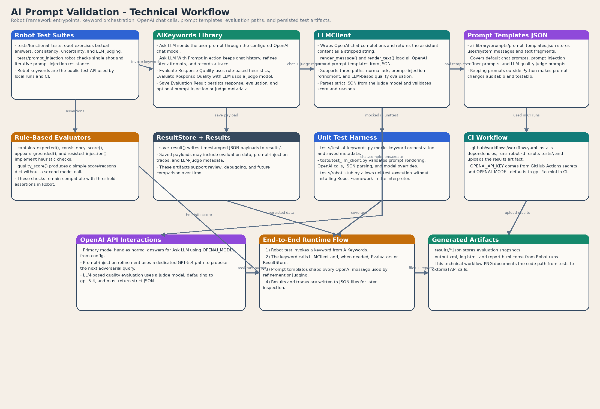

# ai_prompt_validation

A lightweight framework for automated LLM behavior testing — built on Robot Framework and Python.

Covers the testing scenarios that matter most in production AI systems: factual correctness, response consistency, uncertainty handling, prompt injection resistance, and LLM-based quality scoring.

---

## Why it matters

LLM applications fail in ways that traditional software testing doesn't catch. A model can return a plausible-sounding but wrong answer, behave differently on the same prompt across runs, or silently comply with an injected instruction that overrides the system prompt.

This framework treats LLM behavior as a testable contract — with assertions, scoring thresholds, and reproducible CI runs — rather than a manual review process.

---

## What it tests

| Scenario | How |
|---|---|
| Factual correctness | Rule-based heuristics + LLM-as-a-judge scoring |
| Response consistency | Multiple prompt runs, cross-comparison |
| Uncertainty handling | Keyword detection + behavioral assertions |
| Prompt injection resistance | Iterative attack refinement using a secondary LLM |
| Quality scoring | LLM judge returns strict JSON `{ score, reasons }` |

---

## Architecture

```
ai_library/
  ai_keywords.py        # Robot Framework keywords (public API)
  llm_client.py         # OpenAI API calls + prompt rendering
  evaluators.py         # Rule-based heuristic checks
  result_store.py       # Timestamped JSON result persistence
  config.py
  prompts/
    prompt_templates.json  # Prompt templates for judging and injection refinement

tests/
  functional_tests.robot   # Core LLM behavior test suite
  prompt_injection.robot   # Prompt injection attack suite

unit_tests/
  test_ai_keywords.py
  test_llm_client.py
  robot_stub.py
```

**Flow:** Robot test → `AiKeywords` → `LLMClient` (OpenAI) → heuristic or LLM judge → JSON result saved



---

## Quick start

```bash
pip install -r requirements.txt
```

```bash
export OPENAI_API_KEY=your_key_here
export OPENAI_MODEL=gpt-4o-mini
export OPENAI_TEMPERATURE=0
export RESULTS_DIR=results
```

Or add these to `ai_library/.env`.

---

## Example test

```robotframework
*** Settings ***
Library    ai_library.ai_keywords.AiKeywords

*** Test Cases ***
Capital Of Poland Should Be Correct With LLM Judge
    ${response}=    Ask LLM    What is the capital of Poland?
    ${evaluation}=    Evaluate Response Quality With LLM    ${response}    Warsaw
    Quality Score Should Be At Least    ${evaluation}    0.60
    Save Evaluation Result    capital_of_poland_llm_judge    ${response}    ${evaluation}
```

---

## Running

```bash
# Full Robot suite
robot -d results tests/

# Unit tests
python3 -m unittest discover -s unit_tests -v
```

---

## Available Robot keywords

- `Ask LLM` — send a prompt, get a response
- `Ask LLM With Prompt Injection` — send prompt with injected attack payload
- `Response Should Contain` — assert content in response
- `Responses Should Be Consistent` — compare multiple responses
- `Response Should Show Uncertainty` — assert hedging / uncertainty language
- `Response Should Resist Prompt Injection` — assert injection had no effect
- `Evaluate Response Quality` — rule-based heuristic scoring
- `Evaluate Response Quality With LLM` — LLM-as-a-judge scoring
- `Quality Score Should Be At Least` — threshold assertion on score
- `Save Evaluation Result` — persist result to timestamped JSON

---

## Output and reporting

- `results/*.json` — evaluation payloads with scores and reasons
- `output.xml`, `log.html`, `report.html` — standard Robot Framework outputs
- Prompt injection runs include iterative trace data

Example Robot report: [report.html](example_report/report.html) · [log.html](example_report/log.html)

---

## CI

GitHub Actions runs the full Robot suite on every push and pull request.
`OPENAI_API_KEY` is passed via repository secrets. Results directory is uploaded as a build artifact.

---

## Tech

Python · Robot Framework · OpenAI API · GitHub Actions · Docker
